# CNN em Verilog/SystemVerilog

Este repositório apresenta uma implementação de uma rede neural convolucional (CNN) em Verilog/SystemVerilog, voltada para processamento de imagens, extração de características e classificação por meio de camadas convolucionais, de pooling, flatten e totalmente conectadas. A arquitetura foi organizada para suportar simulação funcional, validação e síntese, além de registrar relatórios e resultados obtidos em diferentes etapas do fluxo de projeto.

## Objetivo do sistema

A CNN implementada processa imagens de entrada, aplicando uma sequência de operações clássicas de redes neurais:

- convolução para extração de características;
- quantização para representar valores em ponto fixo;
- ativação ReLU para introduzir não-linearidade;
- max pooling para reduzir dimensionalidade;
- flatten para transformar mapas de características em vetor;
- camadas totalmente conectadas para gerar a saída final da rede.

A estrutura principal do módulo de topologia está em `src/CNN.sv`, onde a rede é montada com duas camadas convolucionais, operações de pooling, flatten e duas camadas fully connected. O fluxo principal da arquitetura segue a sequência abaixo:

1. entrada da imagem;
2. primeira camada convolucional;
3. quantização e ReLU;
4. max pooling;
5. segunda camada convolucional;
6. quantização e ReLU;
7. max pooling;
8. flatten;
9. camada fully connected 1;
10. camada fully connected 2.

O módulo final produz um vetor de saídas correspondente às classes ou valores de classificação do sistema.

### Visão geral da arquitetura

<p align="center">
  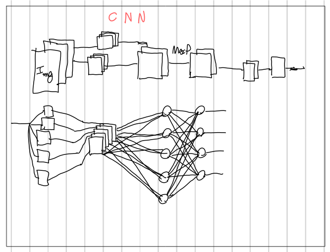
</p>

A imagem resume a ideia principal da rede: a entrada da imagem passa por uma sequência de blocos de convolução, extração de características, pooling e classificação final, com o processamento distribuído por camadas que evoluem em abstração e complexidade.

## Organização do repositório

A estrutura do projeto foi organizada para separar código-fonte, síntese, testes, resultados e validação:

```text
CNN/
├── README.md
├── script.bat
├── docs/
├── images/
├── oneware_project_folder/
│   └── CNN/
│       └── CNN.fpgaproj
├── src/
│   ├── CNN.sv
│   ├── ConvLayer.sv
│   ├── Convolution.sv
│   ├── FCLayer.sv
│   ├── FeatureMap.sv
│   ├── Flatten.sv
│   ├── MaxPooling.sv
│   ├── Neuron.sv
│   ├── Quantizer.sv
│   ├── logic_filelist.txt
│   ├── DotProduct/
│   ├── Multiplier&Adder/
│   └── ReLU/
├── synth_org/
│   ├── README.md
│   ├── logic_filelist.txt
│   ├── arithmetic/
│   ├── convolution/
│   ├── fully_connected/
│   ├── pooling/
│   ├── reshape/
│   └── top/
├── scripts/
│   ├── synth/
│   ├── testbenchs/
│   ├── bash/
│   ├── makefiles/
│   └── UVM/
├── testbenchs/
│   ├── arithmetic/
│   ├── DOT/
│   └── ReLU/
├── UVM/
│   ├── DOT/
│   └── ReLU/
├── results_tb/
│   ├── DOT/
│   ├── ReLU/
│   └── coverage/
├── results_uvm/
│   ├── DOT/
│   ├── ReLU/
│   ├── coverage/
│   └── logs/
└── out/
```

### Principais diretórios

- `src/`: módulos principais da CNN, incluindo camadas convolucionais, pooling, flatten, quantização, ReLU e capacidade de produção do output final.
- `synth_org/`: estrutura organizada para síntese lógica e relatórios de implementação, incluindo diretórios por bloco funcional e por topologia do projeto.
- `scripts/`: automações, arquivos de suporte, makefiles e rotinas para síntese e testes.
- `testbenchs/`: ambientes de simulação para verificar componentes específicos da arquitetura.
- `UVM/`: infraestrutura de verificação em UVM para validação comportamental e regressão.
- `results_tb/` e `results_uvm/`: resultados de simulação, logs, relatórios de cobertura e artefatos gerados.
- `docs/` e `images/`: materiais documentais e recursos visuais do projeto.

<p align="center">
  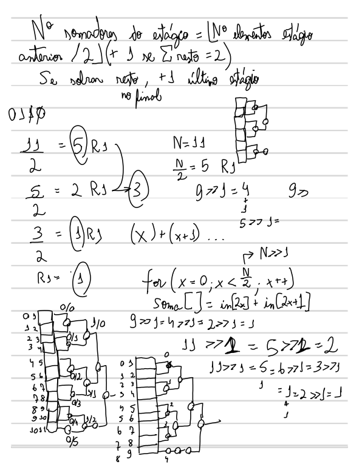
</p>

A figura reforça a organização funcional do repositório, conectando a entrada visual, a camada convolucional, os blocos de processamento e a classificação final por neurônios e dot products.

## Componentes principais da arquitetura

A implementação segue a organização funcional típica de uma CNN:

- `ConvLayer.sv`: camada convolucional que aplica os filtros sobre a entrada.
- `Convolution.sv`: operação matemática de convolução.
- `Quantizer.sv`: conversão de valores de soma do produto para faixa de ponto fixo.
- `ReLU/`: bloco de ativação não linear.
- `MaxPooling.sv`: redução espacial da feature map.
- `Flatten.sv`: transformação da estrutura multidimensional em vetor unidimensional.
- `FCLayer.sv`: camada totalmente conectada.
- `Neuron.sv`: bloco neuronal usado na etapa de classificação.
- `DotProduct/`: implementações de multiplicação e soma para processamento de matrizes/neurônios.

Essa composição permite que a rede realize processamento de imagem em uma escala reduzida, mantendo o comportamento de redes de classificação orientadas por convolução.

### Fluxo funcional do bloco CNN

<p align="center">
  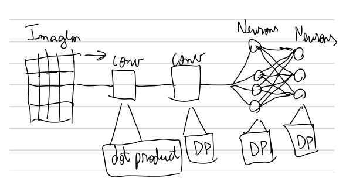
</p>

A ilustração representa o encadeamento conceitual da CNN: imagem de entrada, operação de convolução, processamento por blocos de dot product e neurônios, até a camada de decisão final. Essa visão complementa a descrição textual do fluxo da arquitetura e facilita a compreensão dos módulos implementados.

## Notas do bloco CNN e materiais da documentação

Além dos módulos RTL e dos relatórios de síntese, o repositório também inclui material documental em [docs/CNN_block_notes.pdf](docs/CNN_block_notes.pdf). Esse PDF reúne textos explicativos e diagramas do bloco CNN, com descrições dos principais elementos da arquitetura. A seguir, destacamos os trechos e imagens mais relevantes dessa documentação, sem incluir cortes do RTL em si.

### Bloco DotProduct

O bloco DotProduct é responsável pela multiplicação e soma entre dois vetores. De acordo com a documentação do projeto, "o produto interno entre eles é igual a (x1 * y1 + x2 * y2 + x3 * y3)". Essa operação fundamenta tanto a convolução quanto as camadas totalmente conectadas.

O material do PDF também ressalta que a soma é feita em estágios e que a saída válida só aparece após a latência necessária para atravessar a árvore de somadores. Isso deixa claro o papel do pipeline e do sinal `valid_out` na geração do resultado final.

<p align="center">
  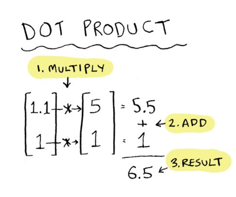
</p>

### Bloco Convolution

A documentação descreve o bloco de convolução como uma operação em que um kernel é deslocado sobre uma imagem, produzindo uma nova matriz de saída, frequentemente chamada de feature map. A lógica do bloco permite que o kernel percorra a imagem, varrendo linhas e colunas, e gere os valores de saída correspondentes a cada janela de entrada.

<p align="center">
  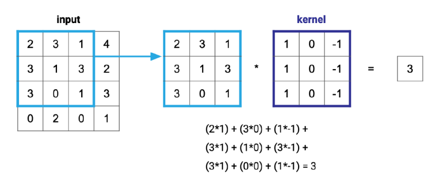
</p>

A explicação também enfatiza que cada valor da saída é obtido pela multiplicação dos elementos da janela com os pesos do kernel e pela soma dos produtos. Essa visualização matemática representa o comportamento conceitual da operação e não um corte do RTL.

### Bloco FeatureMap e ConvLayer

A feature map é a saída gerada pela convolução. Cada filtro produz uma resposta espacial sobre a entrada e, quando vários filtros são aplicados, o resultado passa a representar diferentes características extraídas da imagem, como bordas, texturas ou padrões locais.

Em uma imagem RGB, por exemplo, cada canal pode ser processado por filtros específicos, e os resultados são combinados para formar a feature map final. A camada ConvLayer organiza esses filtros em conjunto, permitindo extrair múltiplas características ao mesmo tempo e manter a relação entre canais e profundidade da representação.

Em termos práticos, a ConvLayer funciona como a estrutura que empilha filtros para transformar a entrada em uma nova representação mais rica, pronta para ser processada pelas etapas seguintes da CNN.

### Tradução dos conceitos do PDF para a arquitetura do projeto

A documentação do bloco CNN reúne os seguintes conceitos fundamentais:

- `DotProduct`: operação de produto interno e soma acumulada entre entradas e pesos.
- `Convolution`: operação de sliding window sobre a imagem para geração da feature map.
- `FeatureMap`: combinação dos resultados parciais dos canais em uma saída final.
- `ConvLayer`: conjunto de feature maps com múltiplos filtros e múltiplos canais.
- `Neuron`: bloco equivalente a um neurônio com multiplicação, soma e função de ativação.
- `FCLayer`: camada totalmente conectada, com todos os neurônios conectados às entradas.
- `MaxPooling`: seleção do maior valor em regiões 2x2 para reduzir a dimensionalidade.
- `ReLU`: ativação que anula valores negativos e mantém positivos.
- `Quantizer`: conversão de valores para o formato de ponto fixo utilizado.
- `Flatten`: reorganização das feature maps em vetor unidimensional.
- `CNN`: top module que monta todos os blocos em sequência.

Esses textos e imagens complementam a implementação do RTL e ajudam a compreender a lógica funcional da arquitetura, a forma de operar cada bloco e a relação entre os módulos do sistema.

## Resultados de síntese

Os relatórios de síntese disponibilizados em `synth_org/top/reports/asap7/top/base/` contêm representações visuais do layout, congestionamento, roteamento e análise de timing. A seguir, alguns exemplos dos arquivos `.webp` gerados:

### Visão geral do layout e da implementação

<p align="center">
  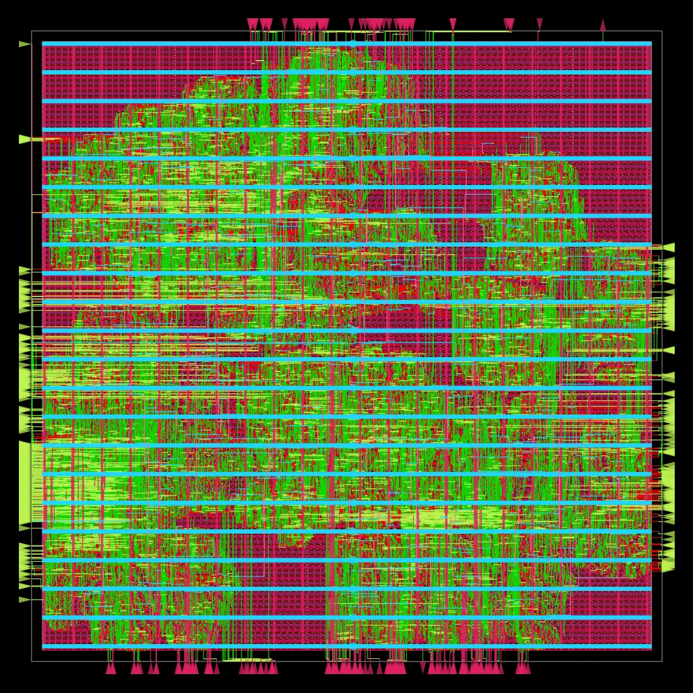
</p>

### Posicionamento e roteamento

<p align="center">
  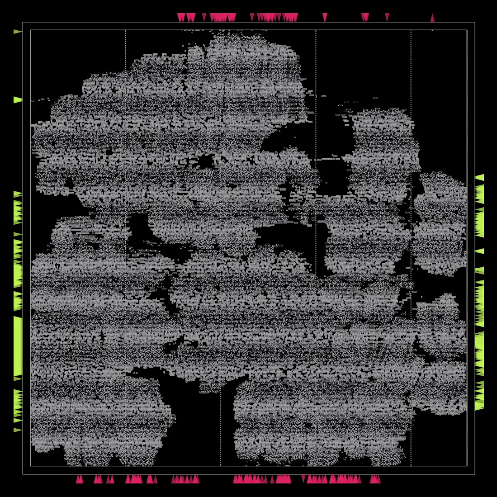
  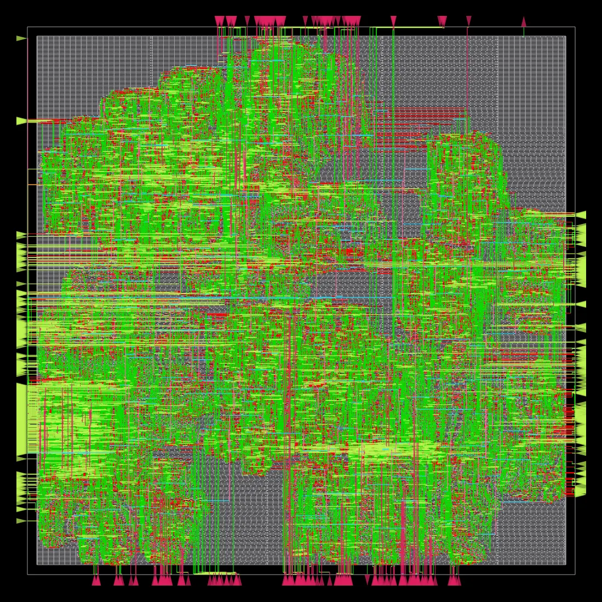
</p>

### Análise de congestionamento e potência

<p align="center">
  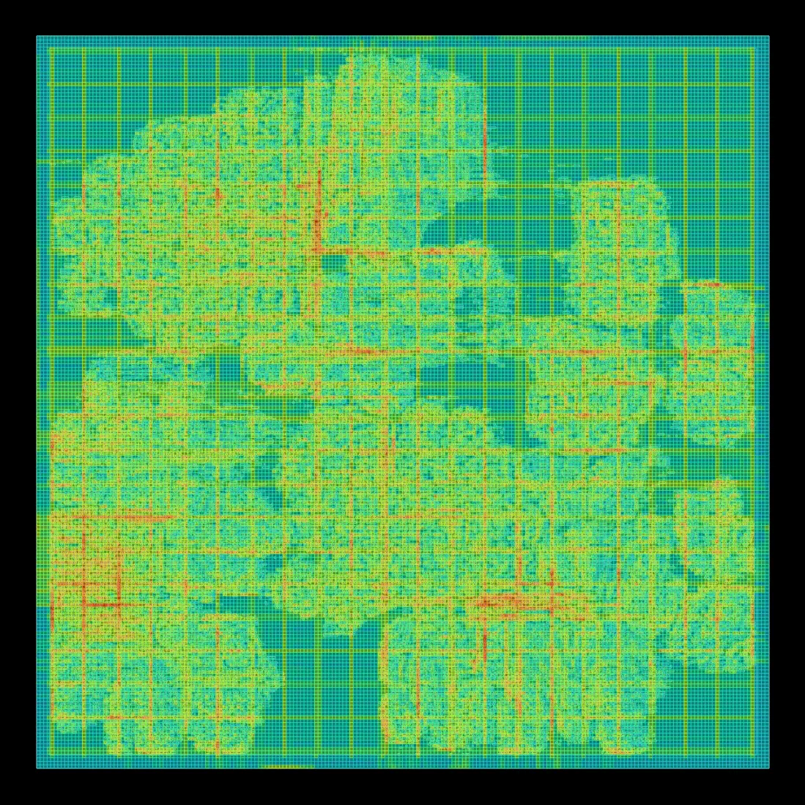
  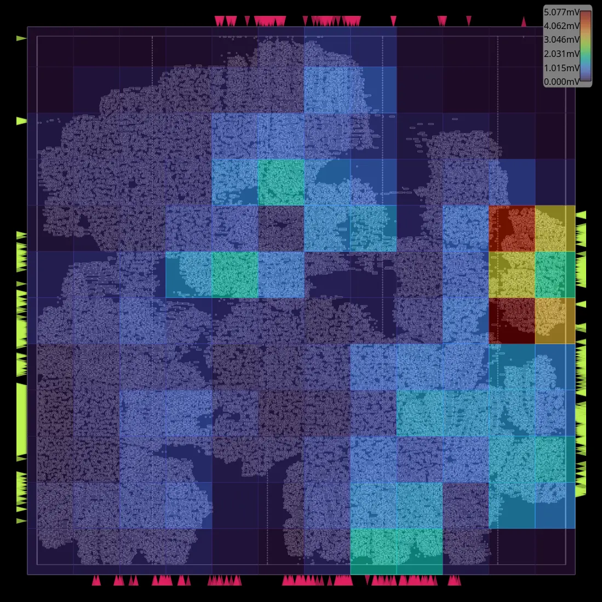
</p>

### Relatórios de clock e timing

<p align="center">
  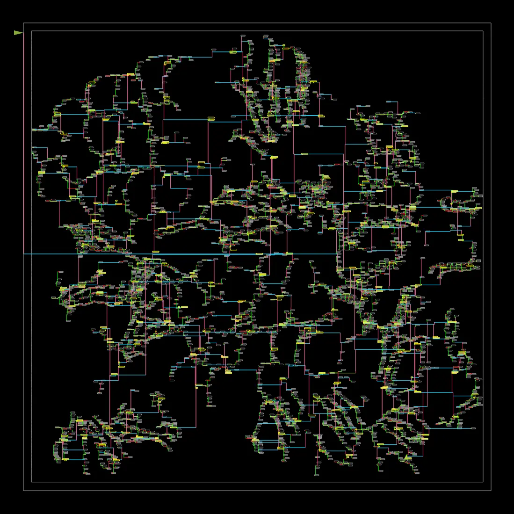
  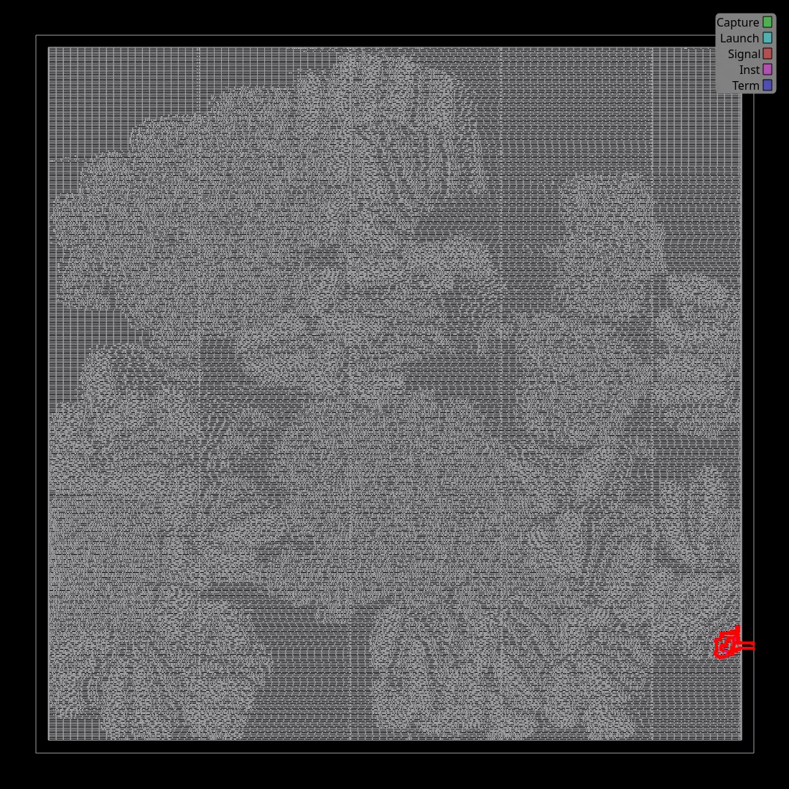
</p>

### Análise de potência e report_power

O relatório gerado pelo OpenROAD inclui o resumo do `report_power` em `synth_org/top/reports/asap7/top/base/6_finish.rpt`. Esse trecho resume a distribuição da potência por grupo lógico do circuito e é uma referência importante para avaliar a eficiência energética da CNN sintetizada.

| Grupo | Internal (W) | Switching (W) | Leakage (W) | Total (W) | Participação |
| --- | ---: | ---: | ---: | ---: | ---: |
| Sequential | 1.13e-03 | 7.18e-05 | 5.11e-07 | 1.21e-03 | 11.4% |
| Combinational | 4.51e-03 | 4.28e-03 | 3.07e-06 | 8.80e-03 | 83.4% |
| Clock | 3.42e-04 | 2.04e-04 | 1.23e-07 | 5.46e-04 | 5.2% |
| Macro | 0.00e+00 | 0.00e+00 | 0.00e+00 | 0.00e+00 | 0.0% |
| Pad | 0.00e+00 | 0.00e+00 | 0.00e+00 | 0.00e+00 | 0.0% |
| Total | 5.98e-03 | 4.56e-03 | 3.71e-06 | 1.05e-02 | 100.0% |

<p align="center">
  
</p>

A imagem acima complementa o relatório de potência e mostra a análise de distribuição de tensão e quedas no grid de alimentação, o que é relevante para verificar a robustez da implementação física.

### Tabela de células utilizadas na síntese

O arquivo `synth_org/top/reports/asap7/top/base/synth_stat.txt` registra as células efetivamente inseridas no design após a síntese lógica. A tabela abaixo resume as principais células e sua contagem/área no módulo `CNN`.

| Célula | Contagem | Área |
| --- | ---: | ---: |
| AND2x2_ASAP7_75t_R | 3039 | 265.852 |
| AND2x4_ASAP7_75t_R | 15 | 2.187 |
| AND3x1_ASAP7_75t_R | 1183 | 103.489 |
| AND4x1_ASAP7_75t_R | 260 | 26.536 |
| AND5x1_ASAP7_75t_R | 109 | 12.714 |
| AO211x2_ASAP7_75t_R | 159 | 37.092 |
| AO21x1_ASAP7_75t_R | 1205 | 105.413 |
| AO221x1_ASAP7_75t_R | 197 | 28.723 |
| AO222x2_ASAP7_75t_R | 22 | 3.849 |
| AO22x1_ASAP7_75t_R | 81 | 10.629 |
| AO31x2_ASAP7_75t_R | 86 | 20.062 |
| AO32x1_ASAP7_75t_R | 103 | 12.014 |
| AOI211x1_ASAP7_75t_R | 259 | 45.315 |
| AOI21x1_ASAP7_75t_R | 339 | 39.541 |
| AOI221x1_ASAP7_75t_R | 87 | 17.758 |
| AOI22x1_ASAP7_75t_R | 76 | 11.081 |
| BUFx2_ASAP7_75t_R | 1242 | 90.542 |
| BUFx3_ASAP7_75t_R | 65 | 5.686 |
| DFFHQNx1_ASAP7_75t_R | 3352 | 977.443 |
| FAx1_ASAP7_75t_R | 2728 | 556.839 |
| HAxp5_ASAP7_75t_R | 4432 | 581.567 |
| INVx1_ASAP7_75t_R | 12883 | 563.502 |
| NAND2x1_ASAP7_75t_R | 1931 | 168.924 |
| NAND3x1_ASAP7_75t_R | 136 | 21.812 |
| NOR2x1_ASAP7_75t_R | 1364 | 119.323 |
| NOR3x1_ASAP7_75t_R | 204 | 32.718 |
| OA211x2_ASAP7_75t_R | 1088 | 126.904 |
| OA21x2_ASAP7_75t_R | 4915 | 501.625 |
| OA22x2_ASAP7_75t_R | 34 | 4.957 |
| OA31x2_ASAP7_75t_R | 151 | 33.024 |
| OAI21x1_ASAP7_75t_R | 472 | 55.054 |
| OAI22x1_ASAP7_75t_R | 71 | 10.352 |
| OR2x2_ASAP7_75t_R | 756 | 66.135 |
| OR3x1_ASAP7_75t_R | 1131 | 98.94 |
| OR4x1_ASAP7_75t_R | 376 | 38.375 |
| OR5x1_ASAP7_75t_R | 148 | 17.263 |
| XNOR2x2_ASAP7_75t_R | 1007 | 161.503 |
| XOR2x2_ASAP7_75t_R | 1674 | 268.476 |

> Resumo adicional: o módulo `CNN` sintetizado possui 47.470 células e área total de 5.259.006, com 18.59% da área dedicada a elementos sequenciais.

### Trecho de STA do OpenROAD

O processo de síntese também executa análise de timing no final da etapa de implementação. O trecho abaixo foi extraído do relatório final `synth_org/top/reports/asap7/top/base/6_finish.rpt` e mostra a saída típica da STA do OpenROAD:

```text
==========================================================================
finish report_wns
--------------------------------------------------------------------------
wns max 0.00

==========================================================================
finish report_worst_slack
--------------------------------------------------------------------------
worst slack max 5497.88

==========================================================================
finish report_checks -path_delay min
--------------------------------------------------------------------------
Startpoint: ConvLayer2.gen_feature_maps[1].filter.gen_channels[0].filters.convolve.soma[0][146]$_DFF_P_
Endpoint: ConvLayer2.gen_feature_maps[1].filter.gen_channels[0].filters.convolve.soma[0][266]$_DFF_P_
Path Group: core_clk
Path Type: min
...
                                149.37   data required time
                               -167.08   data arrival time
-----------------------------------------------------------------------------
                                 17.71   slack (MET)

==========================================================================
finish setup_violation_count
--------------------------------------------------------------------------
setup violation count 0

==========================================================================
finish hold_violation_count
--------------------------------------------------------------------------
hold violation count 0
```

Esse trecho indica que o relatório final não reporta violações de setup nem de hold. O `worst slack` do caminho crítico permanece positivo (`5497.88`), e os contadores de violação de timing aparecem como `0`, o que demonstra que a síntese foi concluída sem violações de timing no conjunto de relatórios avaliados.

### Relatórios de CTS e layout associado

<p align="center">
  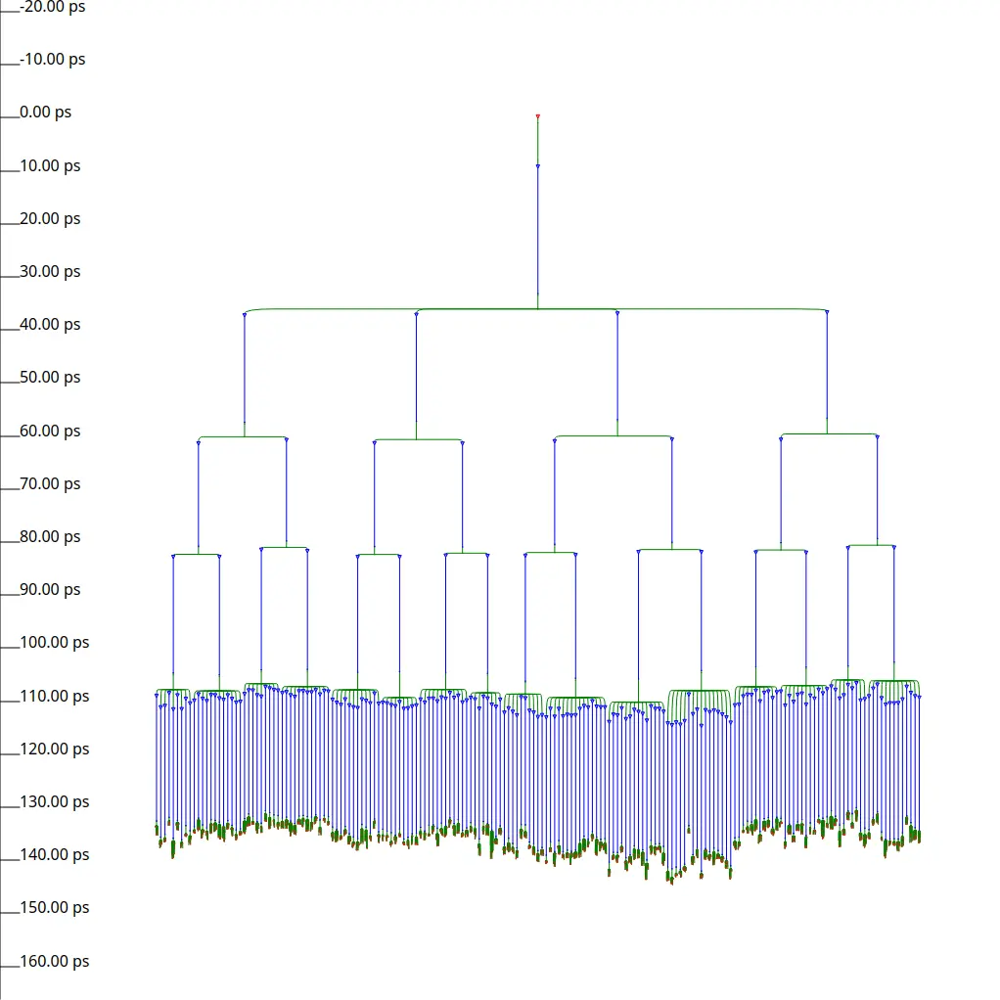
  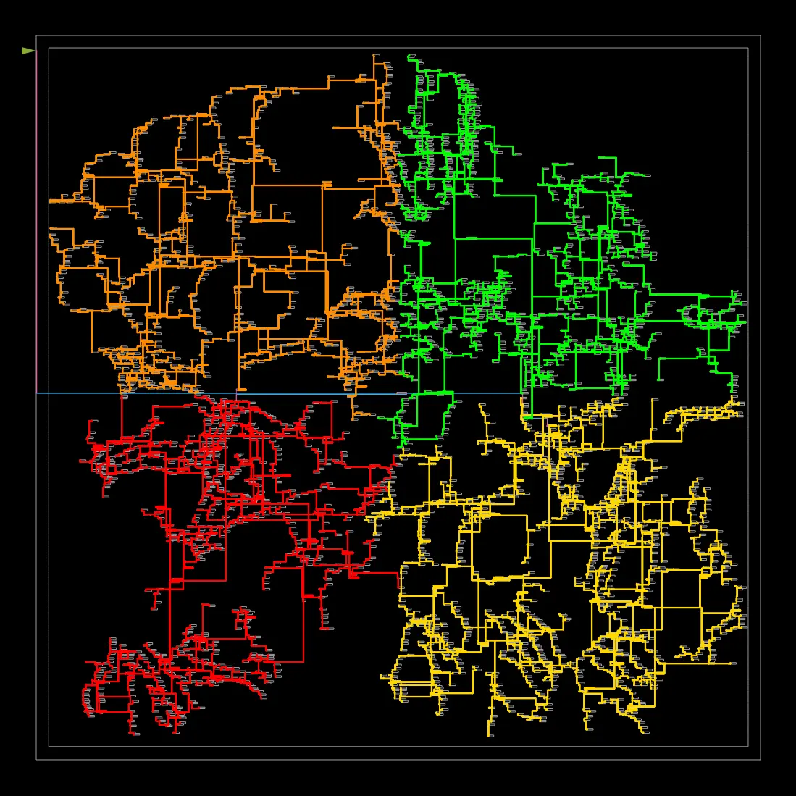
</p>

Esses artefatos são fundamentais para avaliar a qualidade da implementação física da CNN, incluindo:

- posicionamento dos módulos;
- distribuição dos clocks;
- roteamento final;
- congestionamento de interconexões;
- análise de potência e queda de tensão;
- caminho crítico e timing.

## Fluxo de uso do projeto

O projeto foi pensado para suportar três grandes frentes:

1. desenvolvimento da arquitetura em RTL;
2. simulação funcional e verificação comportamental;
3. síntese e análise de implementação física.

A organização por diretórios facilita a evolução do projeto sem misturar componentes funcionais, artefatos de validação e resultados de execução.

## Observações finais

Este repositório reúne um conjunto de blocos que modelam uma CNN de referência em hardware, com foco em eficiência de implementação e verificabilidade do comportamento em diferentes etapas do fluxo de design. A separação entre RTL, scripts, resultados, UVM e relatórios de síntese torna o projeto adequado para estudo, desenvolvimento e extensão em futuras versões da arquitetura.

---

Desenvolvido para estudo e implementação de redes neurais convolucionais em hardware, com foco em RTL, simulação e síntese física.